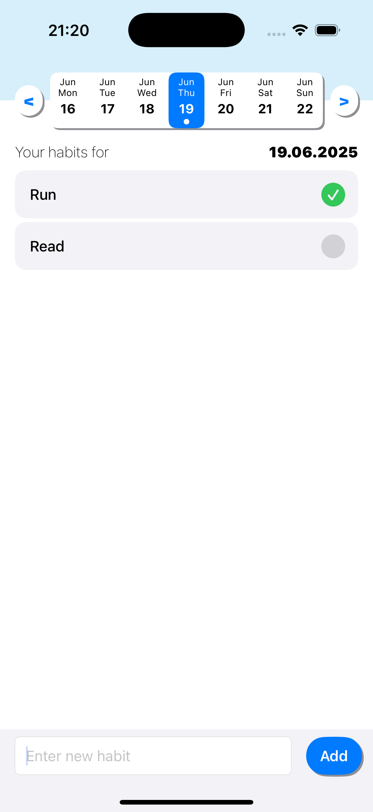

# HabitTracker

**HabitTracker** is a lightweight UIKit-based iOS app that helps users build and track daily habits.

## Features

- 📆 Track daily habit completion
- ➕ Add and delete habits
- ✅ Tap to mark/unmark completion for today
- 💾 Data persistence using Core Data

## Preview of UI

  

## Architecture

- UIKit + MVVM
- Core Data for storage
- Clean separation of concerns (Models / Views / ViewModels / Persistence)
- No storyboards, fully programmatic layout
- Unit testing with XCTest

## Getting Started

1. Clone the repo
2. Open `HabitTracker.xcodeproj`
3. Build and run on simulator or device
